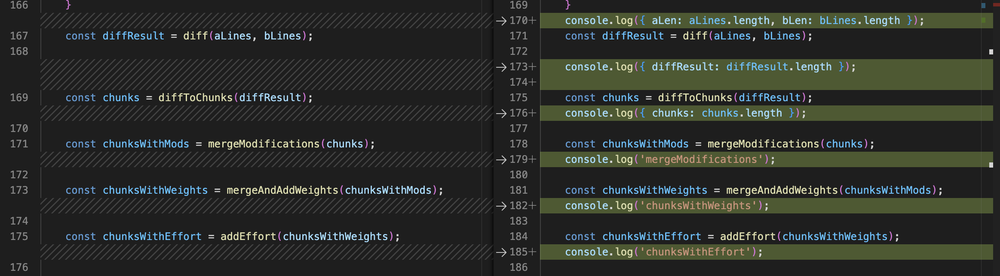
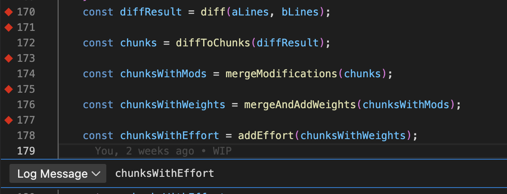
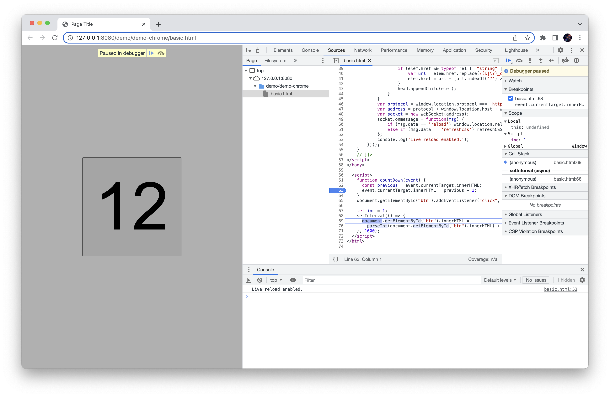
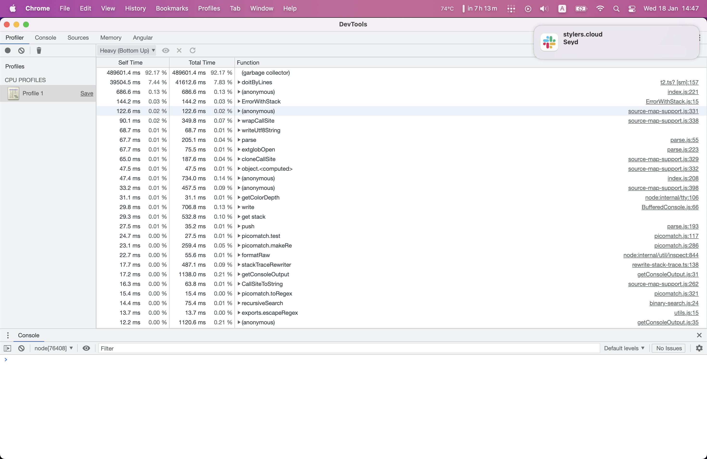

# Debugger!

## What is it good for?

<footer style="margin-top: 20vh;">Stanislav Párnický @ stylers.cloud</footer>

---

## Debugger

- inpect code execution
- show call stack
- read variables
- REPL

Note:

spomenut(?)

- step-by-step execution
- breakpoints

---

### Poll: How do you debug?

1. temporary `console.log()`
1. write more tests
1. staring at code and thinking really hard
1. use debugger

Note:

Na zaciatok mala anketa - Ako debugujete? Ake techniky pouzivate na najdenie bugu ktory viete, ze tam je ale netusite kde presne? Mozete zdvihnut ruku aj viac krat.

Zdvihnite ruku ak hladate bug iba pozretim sa na kod a silnym zamyslenim sa.

Zdvihnite ruku ked hladate bug napisanim dalsich testov.

Zdvihnite ruku ak pridate plno console.log volani.

Zdvihnite ruku ak pouzivate debugger.

Takze vyhral ??? (asi console.log)

Tak sa podme pozriet ako by nam mohol ten debugger pomoct.

---

### 1. Temporary `console.log`

---

<figure>

<figcaption>I will just add few console.logs...</figcaption>
<figure>

Note:

Asi kazdy rad prida par console.log-ov aby lepsie rozumel, co sa stalo, v akom poradi, ake hodnoty ma premenna.
Otvorime subor, napiseme par riadkov, pozreme vysledok. Fixneme bug a commitneme. Ale nastastie mame pre-commit hook s eslint no-console a tak ideme mazat riadky. No co ak by to islo lahsie?

Key point: Aj o console.logy sa treba starat

---

### Logpoints

<figure>

<figcaption>Easy to add, easy to remove</figcaption>
<figure>

Note:

Debuggery casto podporuju "logpoints" co je to iste ako console.log, len sa onho stara debugger. Urcite sa nedostanu do codebase a ked ich chcem zmazat to jednoducho urobim cez debugger, napriklad cez "Remove all breakpoints". Ano, logpoints su specialne breakpointy.

(Su pripady ktore logpoints nezvladaju, ale nie je to vobec tak hrozne)

Key point: Logpoints su ako console.log o ktore sa stara debugger.

---

### So how do I use this debugger thing?

1. Open DevTools Sources tab
2. ???
3. Profit!!!

<a href="/demo/demo-chrome/basic.html" target="_blank">Demo in browser</a>

Note:

- Otvorime DevTools
- najdeme to co nas zaujima
- chceme vediet co sa deje
- Spomenut ze chrome podporuje aj remote debugging

<!--vert-->

<figure>

<figure>

---

### 2. Write more tests

Note:
Mame test ktory failuje, chceme to opravit. Jedna z mozosti je, ze napiseme testy pre podobne pripady a zistime ktore nebudu fungovat, alebo sa pozrieme ake funkcie podla nas vola tato funkcia a napiseme testy pre ne (aj ked doteraz testy nemali lebo to nie je sucast public interface a najskor tie testy po odstraneni bugu zmazeme)

Aj pri pisani testov nam vie pomoct debugger, vieme ho pripojit na testing framework a vyuzit ho pri testoch.

Key point: Debugger sa da pripojit aj ku testom.

---

### VSCode debug

demo-jest

- config launch.json
- run debug

---

### 3. Staring at code and thinking really hard

Note:

Najviac "senior" pristup je poriadne sa zamysliet nad problemom, a prejst si co je napisane. Toto je ale energeticky narocne a ludske telo sa tomu brani. Pouzivanie nastrojov rozmyslaniu nebrani, ale vie rychlo objavit chybne predpoklady ktore mame o programe, kniznici, alebo poradi vykonavania. Nechajte robit pocitace to v com su dobre - nasledovanie prikazov.

Key point: Pouzivanie nastrojov pomaha aj pri silnom zamysleni sa nad problemom.

---

### Profiler

<figure>

<figcaption>Sometimes the bug isn't inside the code</figcaption>
<figure>

Note:

Niekedy sa bug neprejavuje tym, ze nieco spadne, alebo

---

### How it works?

- runtime
- debugger "server"
- debugger "client"

Note:

- describe protocol
- node.js + vscode + chrome compatibility

---

### Debugging mobile

- on mobile

  - allow USB debugging
  - open chrome

- on computer
  - `chrome://inspect`

---

## Key points

- Debuggers are easy to set up
- Logpoints are temporary console.logs
- Breakpoints help you poke around running app
- `debugger;` works when sourcemaps fail
- Debugger has REPL
- Profilers exist

---

#### End

<figure>

<figcaption>Programmer is happy that he caught the bug</figcaption>
<figure>

